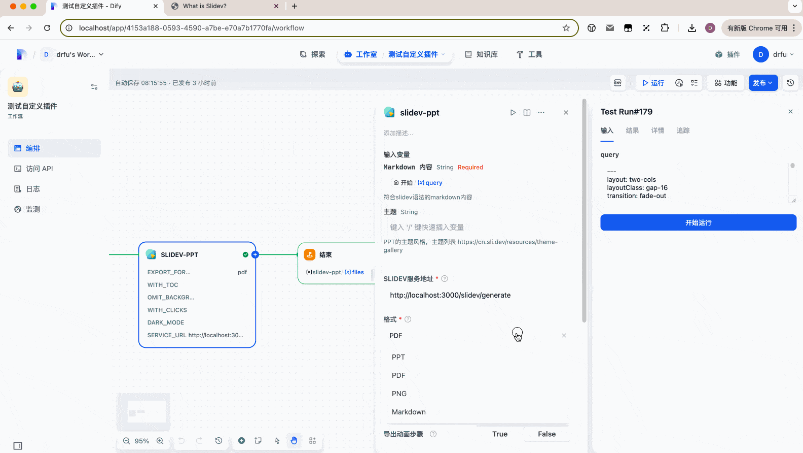

# Slidev for Dify

一个基于 [Slidev](https://cn.sli.dev/guide/) 的 Dify 平台插件，可以将 Markdown 内容一键转换为 PPT 演示文稿。

## 项目概述

本项目为 Dify 平台开发的插件，提供了将 Markdown 格式内容转换为专业 PPT 演示文稿的功能。用户可以轻松地在 Dify 对话中生成和下载 PPTX 格式的演示文稿。

## 项目结构

本项目包含以下主要组件：

- **slidev-plugin**: Dify 插件的 Python 实现，提供与 Dify 平台的集成
  - **tools/slidev-ppt**: 支持生成PPT✔️ / PDF✔️ / PNG 🕑 / MD 🕑
- **slidev-backend**: 基于 NestJS 的后端服务，提供 API 接口用于处理 PPT 的生成
  - **packages/slidev-node**: 基于NestJS的后端服务，提供API接口
  - **packages/slidev-client**: 基于 Slidev 的前端部分，负责演示文稿的渲染和导出

## 部署指南

### 后端服务

1. 进入 slidev-backend 目录
2. 安装依赖：`pnpm install`
3. 启动服务：`pnpm start`

服务默认运行在 http://localhost:3000

### Dify 插件

1. 进入 slidev-py 目录
2. 安装依赖：`pip install -r requirements.txt`
3. 配置 .env 文件（参考 .env.example）
4. 启动插件：`python -m main`
5. 在 Dify 平台导入插件

## 使用方法

在 Dify 中使用该插件时，需要提供以下参数：

1. **markdown** (必填)：Markdown 格式的演示文稿内容
3. **service_url** (必填)：Slidev 后端服务 URL，用于处理 PPT 生成请求